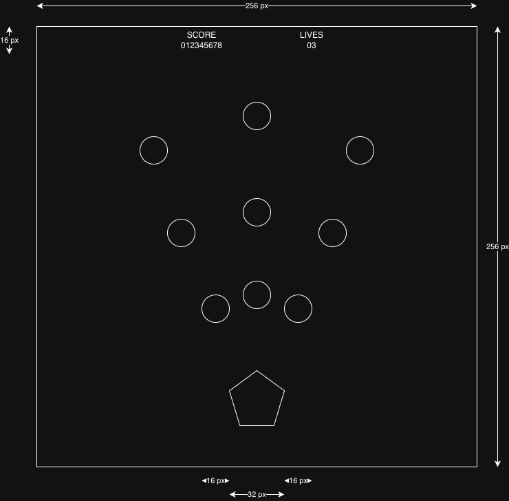
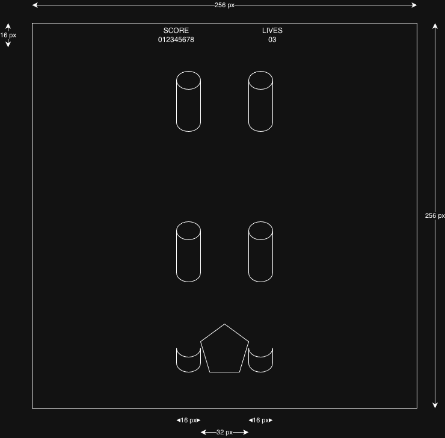
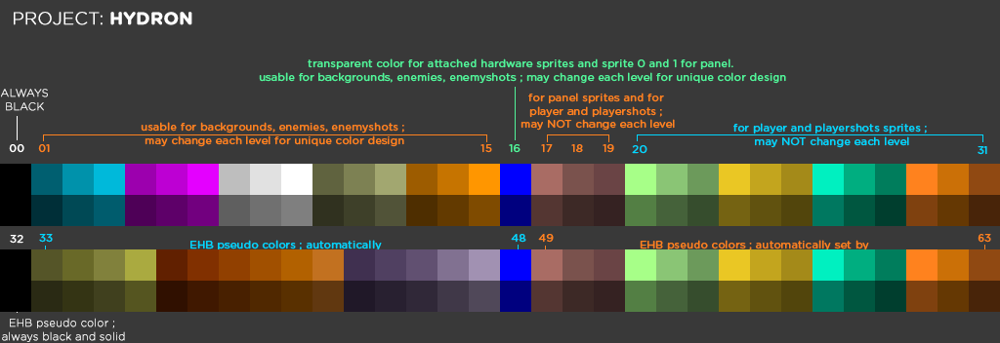

# Use of hardware sprites

Due to DMA bandwith limitations not all 8 hardware sprites can be used when using full screen width of 320 pixels. So we use just a 256 pixels wide screen and therefore can utilise all hardware sprites.

The sprites will be attached giving 4 sprites with 16 colors. Since this is a limitation for each row, sprites can be reused when the intended image part do not overlap vertically.

## Score/lives panel

I will try to use the Hybris-trick with two not attached hardware sprites (should be sprites 0 and 1 because they are on top of the other ones). For the text the colors 17-19 will be usable (color registers counted from 0 to 31). 

Color 16 is transparent for sprites 0 and 1 (and transparent to all attached 16-color sprites).
If I cannot accomplish to recreate the sprite-trick we have to use a separated panel of 16 pixels height and 256 pixels width built with normal bitmaps.

## Player sprite

The spaceship of the player is built by 4 hardware sprites, attached to two 16 pixels wide 16-color sprites giving a total width of 32 pixels. Optionally depending of the actual weapon of the player there may be two guns attached to the left and right of the spaceship, each using two attached sprites of 16 pixels width and 16 colors.

Player movement is restricted so the spaceship always stays below the panel, so the sprites cannot interfere when using the guns attached to the spaceship.

## Playershot sprites

Built of two attached sprites resulting in 16 pixels width and unlimited height. There can be up to 4 shots at each row.

All playershots are drawn only above the playersprite initially and because shots always move faster as the player himself they cannot interfere.

# Backgrounds

The backgrounds will be built of 16x16 pixels blocks and put together with Tiled. May use full color palette (00-63, except 17) giving massive options for design.

Maybe use mainly the EHB pseudo colors (colors 32-63) for background blocks to create a dark environment.

# Blitter objects for enemies, enemyshots and upgrades

Enemies and enemyshots are drawn as blitter objects (aka bobs).

# Basic concept for enemies

I have a flexible system in mind that makes it possible to move the enemies along bezier curves and optionally insert custom assembler code for updating enemies so they will be able to chase the player etc.

The basic idea that I have for the enemies is that there will not be many but they will be big and robust. So my intention is to create an atmosphere of tightness and uneasiness for the player.

# Usage of color palette

| Color   | Usage                                                                                           |
| ------- | ----------------------------------------------------------------------------------------------- |
| 00      | always black and transparent                                                                    |
| 01-15   | usable for backgrounds, enemies, enemyshots ; may change each level for unique color design     |
| 16      | transparent color for attached hardware sprites and sprite 0 and 1 for panel. usable for backgrounds, enemies, enemyshots ; may change each level for unique color design |
| 17      | reserved for panel copper effect ; may be used for player ship and satellites but NOT elsewhere |
| 18-31   | for player ship, player satellites and playershots sprites, may also be used for backgrounds, enemies, enemyshots ; may NOT change each level          |
| 32      | EHB pseudo color ; may be used for backgrounds, enemies, enemyshots ; always black and solid                                                      |
| 33-48   | EHB pseudo colors ; may be used for backgrounds, enemies, enemyshots ; automatically changed each level by "master-colors" 01-16                   |
| 49      | EHB pseudo color ; automatically set by "master-color" 17 ; reserved for panel copper effect ; may NOT be used elsewhere |
| 50-63   | EHB pseudo colors ; may be used for backgrounds, enemies, enemyshots ; automatically set by "master-colors" 18-31 ; stay the same each level       |

IFF files for 16-color hardware sprites (player ship, player satellites, player bullets) must have a palette with color 00 as transparent/black and colors 01-15 that match colors 17-31 from the table above.  
IFF files for panel just have 2 colors, where color 00 is transparent/black and color 01 may be any color (set in the game by copper effect for each scanline).
IFF files for everything else must have 64-color palette that matches color 00-31 and their EHB pseudo colors as colors 32-63 OR (possible with e.g. Grafx2) be native EHB-files with 32 colors that match colors 00-31

# Which colors to use for specific assets

## Panel

1 bitplane (2 colors). Color 00 is transparent, color 01 may be any value (is set ingame by copper color effect).

## Player ship

4 bitplanes (16 colors). Color 00 is transparent, colors 01-15 must match colors 17-31 from full palette.

## Player bullets

4 bitplanes (16 colors). Color 00 is transparent, color 01 must NOT be used (interferes with copper color effect for panel). color 02-15 must match colors 18-31 from full palette.

## Player upgrades (TODO)

6 bitplanes (64 colors EHB mode). Color 00 is transparent, color 17 may NOT be used (interferes with copper color effect for panel). All colors must match full palette.
Because upgrades will appear in every level, only the common parts of the palette may be used (color 00 transparent, colors 18-31 , EHB peeudo colors 50-63).

## All level specific bitplane assets (enemies, enemy bullets, backgrounds)

6 bitplanes (64 colors EHB mode). Color 00 is transparent, color 17 may NOT be used (interferes with copper color effect for panel). All colors must match full palette.
